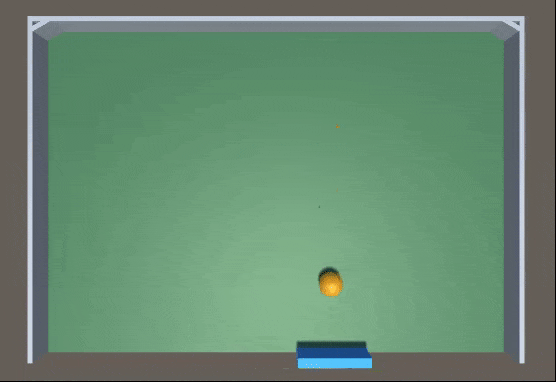
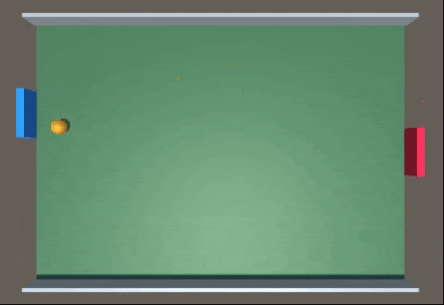

# AiMULA-Getting-Started-Examples
Simple examples of three (classic) reinforcement-learning games that can be trained using the Unity Ml-Agents Toolbox: Catch Ball, Wall Pong and Pong

        

## Background
The Unity Machine Learning Agents Toolkit or ML-Agents is a free, open-source Unity plugin that integrates Unity Technologies Unity3D real-time 3D development platform with a Python API for developing and testing artificial agents (AIs) using reinforcement learning, imitation learning, and other neural network and machine learning techniques. 

The developers of the Unity ML-Agents toolkit have done a fantastic job of making the toolkit as easy to use as possible, especially if you are familiar with the Unity platform and have basic programming skills (C# and Python in particular). The toolkit also includes 10 Example Environments and a tutorial on creating an ML-Agents Unity Environment for AI training and testing. The three games included here provide an additional set of example environments. 

NOTE: We provide a complete the tutorial on how to (i) install the Unity Ml-Agents Toolkit, (2) create the Wall Pong environment and (3) train an ML-Agent to play Wall Pong at:
http://adventuresinunitymlagents.com/getting-started/

## Requirements
A PC, MAC or Unix computer with a fast CPU, good graphics card and a decent amount of memory. A CUDA compatible GPU (graphics card) is not necessary for these examples, as they use vector based state observations (i..e, they do not learn from pixel data).

The latest version of Unity3d (the AiMULA_GettingStartedExamples.unitypackage requires Unity 2018.2.1f1 or above; package prefabs are not backwards compatable). The Personal addition of Unity is free and can be downloaded from here: https://unity3d.com/unity

Python 3. These Unity games were tested using Python 3.6 with Anaconda. Instructions how how to download Python and Anaconda can be found here: https://www.anaconda.com/download/.

The Unity ML-Agents toolkit, which can be download from Github at: https://github.com/Unity-Technologies/ml-agents. The documentation includes an excellent set of Instructions on how to install the ML-Agents toolkit.

# Quick Setup and Training Guide
## Installation
Here we assume you have Unity and the Unity ML-Agents toolkit installed on your machine (these examples we created using Unity 2018.2.1f1 on a Windows 10 machine and ML-Agents Beta v0.5), as well as Anaconda with Python 3.6

For instructions on how to install the Unity ML-Agents toolkit using Anaconda:
 - Windows users should go here: https://github.com/Unity-Technologies/ml-agents/blob/master/docs/Installation-Windows.md
 - Mac/Unix users should go here: https://github.com/Unity-Technologies/ml-agents/blob/master/docs/Installation.md

If you haven’t installed the Unity ML-Agents toolkit, we highly recommend you install the toolkit and the required dependencies within a virtual environment. For instance, create a conda environment called “ml-agents” and install everything needed to run Unity ML-Agents within that virtual environment. For instructions on how to create a virtual (conda) environment go here: https://uoa-eresearch.github.io/eresearch-cookbook/recipe/2014/11/20/conda/

NOTE: We recommend that you DO NOT install the ML-Agents toolkit with GPU support unless you are absolutely sure you are going to be training your agents using image/pixel data. In most cases, particularly when first using the toolkit, your agents will be trained using vector data (i.e., arrays of position and velocity data specifying the location and movement direction of task/game relevant environmental objects and agents), which is typically processed faster using your CPU. If you do want to use your GPU(s) for training, then we recommend you install the toolkit twice, once for CPU based training and then again in a separate virtual environment for GPU based training (i.e., called “ml-agents-gpu”). This means you can easily switch between CPU and GPU based training depending on your needs.

## Setting Up The Unity Development Environment
Open Unity and from the project selector click the +NEW project button. You can call your project whatever you like (e.g, “AiUMLA Games” or “My First ML-Agents Games”). After you enter your project name, make sure the 3D radio button is selected and click Create Project.

### Import the ML-Agents Unity Components
After the main Unity editor window opens, import the necessary Unity ML-Agents package components into the project. This can be done in several ways. The easiest way is to:
 - open up a file browser/explorer window on your computer, locate the directory where you downloaded, saved and installed the Unity ML-Agents toolkit.
 - navigate to the **…\ml-agents\UnitySDK\Assets\ML-Agents sub-folder** 
 - drag/copy the ML-Agents folder (with all of its content and sub-folders) into the Assets folder in the Unity Project Window (don’t worry if you get some error messages in the Unity console window, those will be resolved shortly).

NOTE: you can delete the Examples sub-folder after everything has been imported, but feel free to leave it in if you plan on exploring the Unity ML-Agents examples that come with the toolkit.

### Import the AiUMLA Getting Started Examples Package
- Clone or download this AiMULA getting Started GitHub repository.
 - Import the aiulmagettingstartedexamples.package into the unity project by going to the main menu bar and selecting **Assets -> Import Package -> Custom Package**.
 - Browse to where you download and saved the aiulmagettingstartedexamples.package and click Import.

### Change the Default Project Settings
Go to the main menu bar and select **Edit -> Project Settings -> Player**. The Player Settings panel should open up in the Unity Inspector Window (on the right of the main Unity window if you are using the default window layout). Make the following changes in the Resolution and Presentation panel and the Other Settings panel:

#### Resolution and Presentation:
 - Set Fullscreen Mode to “Windowed”. In older versions of Unity turn Default is Full Screen off (unchecked).
 - Turn Run in Background on (checked) the Display Resolution Dialog should be set to “Disabled”

#### Other Settings:
 - Find the Configuration section
 - For Scripting Runtime Version select **Experimental ( .NET 4.x Equivalent or .NET 4.6 Equivalent)**. Note the Unity Editor may ask to reload, selected yes and after the Editor reloads, navigate back to Other Settings panel via Edit -> Project Settings -> Player.
 - In the input box under Scripting Define Symbols type in the flag **ENABLE_TENSORFLOW**. Make sure you hit enter on your keyboard after typing in the flag (again, don’t worry if you get some error messages popping up in the Unity console window).
 - After making the above changes, make sure you save the project: File -> Save Project

### Install the TensorFlow C# Unity Plugin
The Tensorflow C# plugin can be downloaded here [https://s3.amazonaws.com/unity-ml-agents/0.4/TFSharpPlugin.unitypackage] and is necessary to run and test your agents after training. To install (import) the plugin, simply double click on the file after it has downloaded and you have uncompressed/unzipped it. Once the Unity import file window opens up, click the Import button. 

Make sure you save the project: File -> Save Project

## Play the Example Games Yourself (as a player)
 - From the project Window, open up the corresponding game scene you wish to play (e.g., CatchBall, WallPong, Pong).
 - Expand the Academy oject in the Hierarchy Window.
 - Select the correspdong Brain object (e.g., CatchBallBrain, WallPongBrain, PongBrain).
 - In the Inspectory Panel set the **Brain Type = Player**. 
 - Note the specified keyboard inputs for game play, which should be listed below Barin Type (Player) in the Inspector Panel.
 - Press the game play button at the top of the Unity Editor and then when the game starts in the Game Window, test the game by playing a few rounds.

## Agent Training Using the ML-Agents PPO Algorithm
The PPO process that comes with the ML-Agents toolkit can be used to train agents to play each game. Proximal Policy Optimization or PPO is a state-of-the-art RL algorithm that uses an artificial neural network to approximate the optimal state-action policy. It is the default RL method for ML-Agents (as well as openAI) and can be employed for RL tasks that involve discrete or continuous action spaces. If you are interested in learning more about PPO please visit:
 - https://github.com/Unity-Technologies/ml-agents/blob/master/docs/Training-PPO.md
 - https://blog.openai.com/openai-baselines-ppo/

For ML-Agents, the PPO algorithm is implemented using Tensorflow. The learning process is run via the Python API that can communicate with both a compiled Unity application or the Unity Editor. This Python <-> Unity process means that you can use the provided PPO algorithm for RL, as well as write your own custom RL or ML algorithms.

### Setting the Training Hyperparameters
Before executing the ML-Agents PPO training process, we first need to either (i) set the training hyperparameters in the trainer_config.yaml file or (ii) copy/move the aiumla_config.yaml file that comes with this repository into the **...mlagent/config/** directory. These hyperparameters include the size (number of nodes and layers) of the artificial neural network that will be employed for training, the size of the memory buffer used for training, the training batch size, the learning rate, the max number of training steps, etc. A detailed description of the hyperparameters that can be set in the ML-Agents trainer_config.yaml file can be found here: PPO Hyperparameters.

The ML-Agents trainer_config.yaml file actually has a default set of hyperparameters than can be used ‘out-of-the-box’ so to speak, but it is always better to create your own brain/agent specific set of hyperparameters like we have done in the aiumla_config.yaml file.
 
### Set the Brain Type = External (Essential for Agent Training)
 - From the project Window, open up the corresponding game scene you wish to play (e.g., CatchBall, WallPong, Pong).
 - Expand the Academy oject in the Hierarchy Window.
 - Select the correspdong Brain object (e.g., CatchBallBrain, WallPongBrain, PongBrain).
 - In the Inspectory Panel and set the **Brain Type = External**. 
 
### Executing the Training Process
To run the PPO training processes, we need to run the ML-Agents training program learn.py from a command prompt. Here we assume that you have installed the ml-agents toolkit in a virtual (conda) environment called “ml-agents” using Anaconda. Although you can run the training process using a compiled (standalone) Unity application, which is beneficial if you want to run multiple training instances simultaneously, for the sake of simplicity here we will detail how to complete the training process by playing the game directly in the Unity Editor.

#### Open up an Anaconda Prompt.
 - If you installed ML-Agents in a virtual environment, activate that virtual (conda) environment; e.g., enter the command: 
 
 `conda activate ml-agents`
 
 - Change the directory to the python sub-directory of the ml-agents directory. e.g., enter the command:
 
 `cd yourpath/ml-agents/python`
 
 - To start the learning/training process, call the ML-Agents learn.py script.
 - If you are using the config files that comes with this repositroy and have moved a copy of it to the **...mlagent/config/** directory, type in the following command to start the training process and press ENTER:
 
 `mlagents-learn.py config/aiumla_config.yaml –run-id=gamenameTest1 –train`
 
 - If you are using the default trainer_config.yaml file that comes with Unity Ml-Agents, type in the following command to start the training process and press ENTER: '
 
`mlagents-learn.py config/trainer_config.yaml –run-id=gamenameTest1 –train`

 - Note that the –train command specifies that you are training an agent. The —run-id command specifies a a unique identifier for the Tensorflow checkpoint summary and model files generated during training. you can replace "gamenameTest1" with whatever run-id you want.

 - After the training settinsg appear in the Anaconda prompt window, the following line should appear: **Start training by pressing the Play button in the Unity Editor**. 
 - Go back the Unity Editor and press the Play button.
 - Once the game starts you should see the Agent Paddle(s) in each game begin to learn!
 - Agent progress, that is, the Agent’s average score at each summary frequency update (i.e., every 2000 steps), will be displayed in the Anaconda prompt.
- Agents should learn to play each game within 20,000 to 70,000 steps.

## Importing and Testing a Trained Model
You can test a trained model either using the trained models provided in the TF-Models folder in the , or by importing your own model post training. Model files are "*.bytes*" files are correspond to a Tensorflow Graph file and play the games using the state-action policy specified by the model.

### Using the Provided Model (bytes) Files
 - From the project Window, open up the corresponding game scene you wish to play (e.g., CatchBall, WallPong, Pong).
 - Expand the Academy oject in the Hierarchy Window.
 - Select the correspdong Brain object (e.g., CatchBallBrain, WallPongBrain, PongBrain).
 - In the Inspectory Panel and set the **Brain Type = Internal**. 
 - Drag the corresponding model bytes file (e.g., catchball.bytes, wallpong.bytes, pong.bytes) from the TF_Models folder in the Unity Project Window into the Graph Model input field in the Brain (script) component in the Inspector panel.
 - Save the scene (File -> Save Scene).
 - Save the project (File -> Save Project).
 - Press the Play button at the top of the Unity Editor and watch your agent play.
 - If everything went according to plan, your Paddle Agent should never miss a ball.
 
### Using the Your Own Trained Model (bytes) Files
 - Open up an file explorer window (a finder window on a Mac) and navigate to where you saved the ML-Agents toolkit.
 - In the yourpath/ml-agents/python/models/ you should find a directory (folder) with the run-id name you specified when you executed training. For example, if you set the run-id=wpT1, the folder will be named wpT1.
 - Open the directory (folder) and find the bytes file with the corresponding run-id name at the end of the filename. Because we trained the agent directly in the Unity Editor, the file should have a name like “editor_Academy_wpT1.bytes”.
 - Copy or drag the bytes file into the TF_Files folder in the Unity Editor’s Project Window.
 - Complete the steps listed above under "Using the Provided Model Files"

# Detailed Installation, Setup and Training Instructions
Please visit http://adventuresinunitymlagents.com/getting-started/ for realted tuorial about:
- installing the ml-agents toolkit into unity to test and modify the games included here.
- setting up the unity development environment before importing the unity package included here.
- import the ml-agents components in to a unity project.
- changing the default unity project settings to train and test ml-agents.
- finalizing and testing the included wall pong (catch ball and pong) games.
- playing and testing the games yourself (as a player).
- getting the games ready for RL training.
- agent training using ppo.
- setting the training hyperparameters.
- executing the training process.
- importing and testing the trained model.

Further details on using the ML-Agents toolkit can be found here: https://github.com/Unity-Technologies/ml-agents/tree/master/docs
