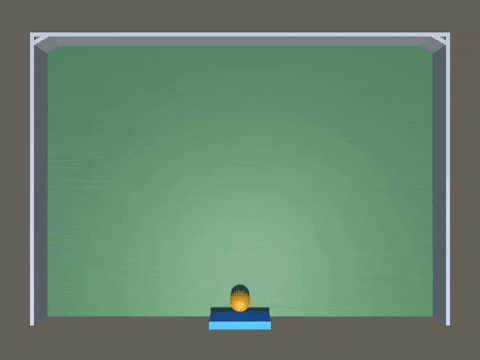

# AiMULA-Getting-Started-Examples
Simple examples of three (classic) reinforcement-learing games that can be trained using the Unity Ml-Agents Toolbox: Catch Ball, Wall Pong and Pong

# Background
The Unity Machine Learning Agents Toolkit or ML-Agents is a free, open-source Unity plugin that integrates Unity Technologies Unity3D real-time 3D development platform with a Python API for developing and testing artificial agents (AIs) using reinforcement learning, imitation learning, and other neural network and machine learning techniques. 

The developers of the Unity ML-Agents toolkit have done a fantastic job of making the toolkit as easy to use as possible, especially if you are familiar with the Unity platform and have basic programming skills (C# and Python in particular). The toolkit also includes 10 Example Environments and a tutorial on creating an ML-Agents Unity Environment for AI training and testing. The three games included here provide an additional set of example environments. 

NOTE: We provide a complete the tutorial on how to (i) install the Unity Ml-Agents Toolkit, (2) create the Wall Pong environment and (3) train an ML-Agent to play Wall Pong at:
http://adventuresinunitymlagents.com/getting-started/

# Requirements
A PC, MAC or Unix computer with a fast CPU, good graphics card and a decent amount of memory. A CUDA compatible GPU (graphics card) is not necessary for these examples, as they use vector based state observations (i..e, they do not learn from pixel data).

The latest version of Unity3d. The Personal addition of Unity is free and can be downloaded from here: https://unity3d.com/unity

Python 3. These Unity games were tested using Python 3.6 with Anaconda. Instructions how how to download Python and Anaconda can be found here: https://www.anaconda.com/download/.

The Unity ML-Agents toolkit, which can be download from Github at: https://github.com/Unity-Technologies/ml-agents. The documentation includes an excellent set of Instructions on how to install the ML-Agents toolkit.

# Installation, Setup and Training
Please visit http://adventuresinunitymlagents.com/getting-started/ for realted tuorial about:
- installing the ml-agents toolkit inot unity to test and modify the games included here.
- setting up the unity development environment before importing the unity package included here.
- import the ml-agents components in to a unity project.
- changing the default unity project settings to train and test ml-agents.
- finalizing and testing the included wall pong (catch ball and pong) games.
- playing and testing the games yourself (as a player).
- getting the games ready for RL training.
- agent training using ppo.
- setting the training hyperparameters.
- executing the training process.
- importing and testing the trained model.

Further details on using the ML-Agents toolkit can be found here: https://github.com/Unity-Technologies/ml-agents/tree/master/docs
